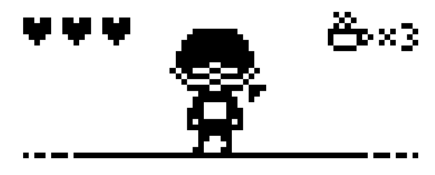
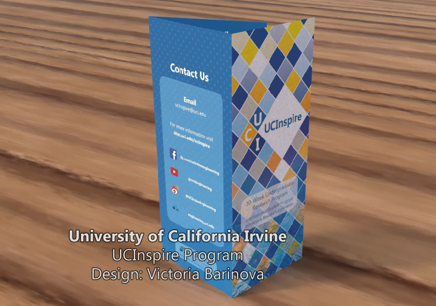
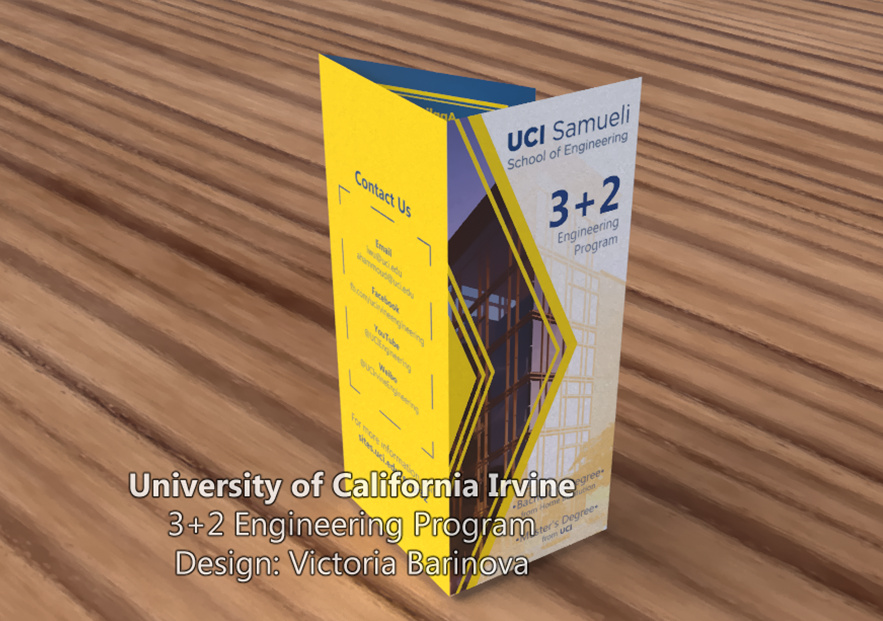
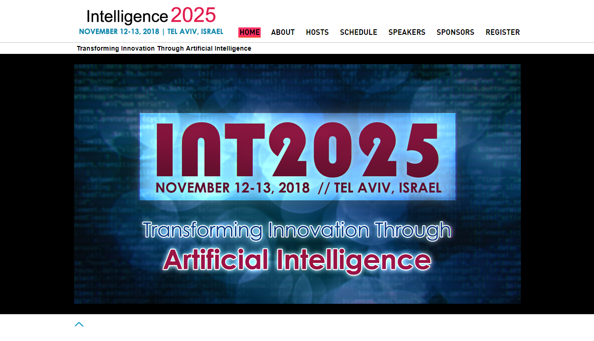
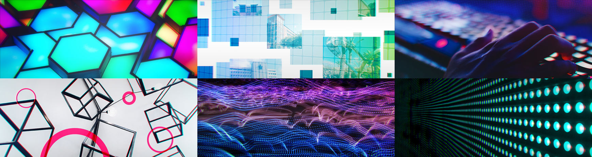

# Welcome!

## This is Victoria Barinova's work showcase.
 
 
<i>I specialize in 2D digital art, but my academic coursework is heavily involved in software engineering, computer science, and game development.
For class projects, I've done a lot of UI art and design implementations in code.
 Current work interests and focus: Graphic design, interface design</i>

### Navigation
Things I do:
- <a href="#h1">Graphic Design</a>
- <a href="#h2">Game Development</a>
- <a href="#h3">Illustrations</a> (hobby)

<h2><a name="h1">Graphic Design</a></h2>
<i>These are my graphic design works during my employment at UCIrvine while a student. The brochure designs are shown as 3D-generated demos I made during the production.</i> 
<i>I have also designed the website logo for the <b><a href="https://sites.uci.edu/ucinspire/">UCInspire program</a>.</b></i>

 
Design Notes: For this brochure, I had decided to evolve the main cover page from the program logo that I created earlier. The color scheme follows the UCIrvine brand guidelines, but the placement of colors is intended to portray a sort of playful feeling to go along with the program's summer timeframe.  
<b><a href="https://sites.uci.edu/engr32/">3+2 Engineering Program</a> brochure</b>
 
Design Notes: For this brochure, I continued to follow the UCI brand standards for the color scheme, and decided to focus on a modern but professional looking theme for the overall look of the design as the program is a combination of bachelor's and master's degrees for involved students.  
<b><a href="http://int2025.eng.uci.edu/">INT2025 Conference Website</a></b> 
<i>I have created the logo, home, and page banners for the INT2025 conference website.
   Everything was made using CC0 stock images.</i>

 
Design Notes: For the website, I considered the main conference theme - Artificial Intelligence in 2025- and decided to go for a modern look to evoke the feeling of 'future technology' and decide on the cyan with magenta accent for the color scheme.
    

<h2><a name="h2">Game Development</a></h2>
<i>Below are the games I have worked outside of my classes with small teams. Recent to oldest release order.</i>
<strong>Click project titles to see more details </strong>
<h3><a href="https://penguindigital.itch.io/bombsaway">Bombs Away</a></h3>
  <ul><li>3D airship station management game project for <strong>UCI Computer Game Science Capstone class.</strong></li>
  <li>Key role: Art direction, 2D art assets, UI design/implementation, shaders</li></ul>
  
  
  
  Trailer I made:
  <iframe width="560" height="315" src="https://www.youtube-nocookie.com/embed/wAv6NmYhYIA" frameborder="0" allow="accelerometer; autoplay; encrypted-media; gyroscope; picture-in-picture" allowfullscreen></iframe>
    
 
<h3><a href="https://transformativeplay.ics.uci.edu/shadowcast/">ShadowCast</a></h3>
  <ul><li>Mixed reality musical theater karaoke spectacle.</li>
  <li>Key role: UI art, graphic design (logo, promotional materials)</li></ul>
  
Production process with this project has been with 15-20 people in Agile environment. Aside from key work I've done, I helped a lot with the initial development and research on art style and graphics for the project. 
    
  
<h3><a href="https://theavianlord.itch.io/a-corgi-at-night">A Corgi at Night</a></h3>
  <ul><li>A 2D platformer game about a lost corgi trying to get back to its owners.</li>
  <li>Key role: Opening cutscene, UI design, various art assets</li></ul>
  
  
    
  
<h3><a href="https://neizuu.itch.io/augmented-shopping-rush">Augmented Shopping Rush</a></h3>
  <ul><li>A quick 3D physics game done for Ludum Dare 42 gamejam. Theme: "Running out of Space". Done in 72 hours with a partner.</li>
  <li>Key role: Main Menu UI design and implementation, 2D art assets, scripting</li></ul>
  
  <i>Gameplay</i>
  
  
    
  
<h3><a href="https://theavianlord.itch.io/rance-rance-human-devolution">Rance Rance Human Devolution</a></h3>
  <ul><li>Parody dancing game.</li>
  <li>Key role: UI, character, and art design</li></ul>
  

  

<h3><a href="https://theavianlord.itch.io/xylo">Xylo</a></h3>
 <ul><li>A 2D sci-fi horror game about a crashed ship crew.</li>
  <li>Key role: character designer, artist for additional prop assets</li></ul>
  
  

   

<h2><a name="h3">Illustrations</a></h2>
<i>I do some occasional digital original and fanwork illustrations! It is mainly a hobby, however it gave me great practice for visual designs and skills for game development.</i> 

 Tools: Clip Studio Paint, Photoshop
