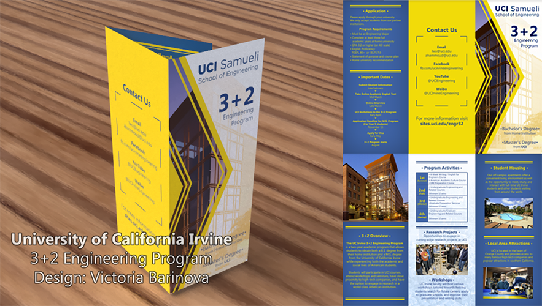

# Welcome!

## This is Victoria Barinova's portfolio.

### Navigation
Things I do:
- <a href="#h1">Graphic Design</a>
- <a href="#h2">Game Development</a>
  1. UI design
  2. 2D art assets
  3. Scripting
- <a href="#h3">Illustrations</a> (hobby)

<h2><a name="h1">Graphic Design</a></h2>
<i>I have designed website logo and brochure for UCInspire program at UCIrvine.</i>

3+2 Engineering Program brochure

INT2025 Conference Website

<h2><a name="h2">Game Development</a></h2>
<i>These are the games I have worked outside of my classes with small teams. Recent to oldest release order.</i>
<h3><a href="https://theavianlord.itch.io/a-corgi-at-night">A Corgi at Night</a></h3>
  <ul><li>A 2D platformer game about a lost corgi trying to get back to its owners.</li>
  <li>Key role: Opening cutscene, UI design, various art assets</li></ul>
  
  
    
  
<h3><a href="https://neizuu.itch.io/augmented-shopping-rush">Augmented Shopping Rush</a></h3>
  <ul><li>A quick 3D physics game done for Ludum Dare 42 gamejam. Theme: "Running out of Space". Done in 72 hours with a partner.</li>
  <li>Key role: Main Menu UI design and implementation, 2D art assets, scripting</li></ul>
  
  <i>Gameplay</i>
  
  
    
  
<h3><a href="https://theavianlord.itch.io/rance-rance-human-devolution">Rance Rance Human Devolution</a></h3>
  <ul><li>Parody dancing game.</li>
  <li>Key role: UI, character, and art design</li></ul>
  

  

<h3><a href="https://theavianlord.itch.io/xylo">Xylo</a></h3>
 <ul><li>A 2D sci-fi horror game about a crashed ship crew</li>
  <li>Key role: character designer, artist for additional prop assets</li></ul>
  
  

   

<h2><a name="h3">Illustrations</a></h2>
<i>I do some occassional digital fanwork! It is mainly a hobby, however it gave me great practice for visual designs and skills for game development.</i>
Tools: Clip Studio Paint, Photoshop
